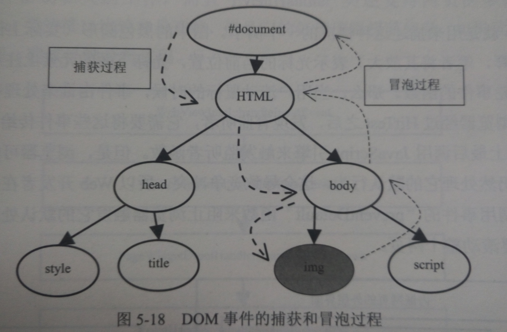

## HTML 解释器和 DOM 模型

在[《第二章 HTML 网页和结构》](./HTML 网页和结构.md)，我们讲到了 WebKit 渲染过程，在WebKit 接收到各种网页或资源的数据之后，网页被交给 HTML 解释器创建 DOM 树。上一章讲了资源是如何加载的，那么这一章接着这个过程讲 HTML 是如何转化为 DOM 树的。

### DOM 模型

DOM，文档对象模型（Document Object Model）。DOM 是 W3C（万维网联盟）的标准，DOM 定义了访问 HTML 和 XML 文档的标准。在 W3C 的标准中，DOM 是独于平台和语言的接口，它允许程序和脚本动态地访问和更新文档的内容、结构和样式。

W3C DOM 由以下三部分组成：

- 核心 DOM - 针对任何结构化文档的标准模型
- XML DOM - 针对 XML 文档的标准模型
- HTML DOM - 针对 HTML 文档的标准模型

#### 历史

###### DOM Level 0

JavaScript 在早期版本中提供了查询和操作 Web 文档的内容 API（如：图像和表单），在 JavaScript 中定义了定义了 'images'、'forms' 等，因此我们可以像下这样访问第一张图片或名为“user”的表单：

```
document.images[0]
document.forms['user']
```

这实际上是未形成标准的试验性质的初级阶段的 DOM，现在习惯上被称为 DOM Level 0，即：第0级 DOM。由于 DOM0 在 W3C 进行标准备化之前出现，还处于未形成标准的初期阶段，这时 Netscape 和 Microsoft 各自推出自己的第四代浏览器，自此 DOM 遍开始出各种问题。

Netscape Navigator 4 和 IE4 分别发布于1997年的6月和10月，这两种浏览器都大幅扩展了 DOM，使 JavaScript 的功能大大增加，而此时也开始出现一个新名词：DHTML。

DHTML 是 Dynamic HTML（动态HTML）的简称。DHTML 并不是一项新技术，而是将 HTML、CSS、JavaScript 技术组合的一种描述。即：

- 利用HTML把网页标记为各种元素
- 利用CSS设置元素样式及其显示位置
- 利用JavaScript操控页面元素和样式

利用 DHTML，看起来可以很容易的控制页面元素，并实现一此原本很复杂的效果（如：通过改变元素位置实现动画）。但事实并非如此，因为没有规范和标准，两种浏览器对相同功能的实现确完全不一样。为了保持程序的兼容性，程序员必须写一些探查代码以检测 JavaScript 是运行于哪种浏览器之下，并提供与之对应的脚本。JavaScript 陷入了前所未有的混乱，DHTML 也因此在人们心中留下了很差的印象。

###### DOM Level 1 的出现

在浏览器厂商进行浏览器大站的同时，W3C 结合大家的优点推出了一个标准化的 DOM，并于1998年10月完成了第一级 DOM，即：DOM Level 1。W3C 将 DOM 定义为一个与平台和编程语言无关的接口，通过这个接口程序和脚本可以动态的访问和修改文档的内容、结构和样式。

DOM1 级主要定义了 HTML 和 XML 文档的底层结构。在 DOM Level 1中，DOM 由两个模块组成：DOM Core（DOM核心）和DOM HTML。其中，DOM Core 规定了基于 XML 的文档结构标准，通过这个标准简化了对文档中任意部分的访问和操作。DOM HTML 则在 DOM 核心的基础上加以扩展，添加了针对 HTML 的对象和方法，如：JavaScript 中的 Document 对象。

###### DOM Level 2 与 DOM Level 3

在 DOM Level 1 的基础上 DOM Level 2 和 DOM Level 3 引入了更多的交互能力，也支持了更高级的XML特性。DOM Level 2 和 DOM Level 3 将 DOM 分为更多具有联系的模块。DOM Level 2 在原来 DOM 的基础上又扩充了鼠标、用户界面事件、范围、遍历等细分模块，而且通过对象接口增加了对 Css 的支持。DOM Level 1 中的 DOM 核心模块也经过扩展开始支持 XML 命名空间。在 DOM Level 2 中引入了下列模块，在模块包含了众多新类型和新接口：

- DOM 视图（DOM Views）：定义了跟踪不同文档视图的接口
- DOM 事件（DOM Events）：定义了事件和事件处理的接口
- DOM 样式（DOM Style）：定义了基于 Css 为元素应用样式的接口
- DOM 遍历和范围（DOM Traversal and Range）：定义了遍历和操作文档树的接口

DOM3 进一步扩展了 DOM，在 DOM3 中引入了以下模块：

- DOM 加载和保存模块（DOM Load and Save）：引入了以统一方式加载和保存文档的方法
- DOM 验证模块（DOM Validation）：定义了验证文档的方法
- DOM 核心的扩展（DOM Style）：支持 XML 1.0 规范，涉及 XML Infoset、XPath 和 XML Base

#### DOM 树

DOM 结构构成的基本要素是 “节点”，而文档的 DOM 结构就是由层次化的节点组成。节点接口由 IDL 语言来描述，具体的实现看下一节的内容。

- 元素节点：Node.ELEMENT_NODE(1)
- 属性节点：Node.ATTRIBUTE_NODE(2)
- 文本节点：Node.TEXT_NODE(3)
- CDATA节点：Node.CDATA_SECTION_NODE(4)
- 实体引用名称节点：Node.ENTRY_REFERENCE_NODE(5)
- 实体名称节点：Node.ENTITY_NODE(6)
- 处理指令节点：Node.PROCESSING_INSTRUCTION_NODE(7)
- 注释节点：Node.COMMENT_NODE(8)
- 文档节点：Node.DOCUMENT_NODE(9)
- 文档类型节点：Node.DOCUMENT_TYPE_NODE(10)
- 文档片段节点：Node.DOCUMENT_FRAGMENT_NODE(11)
- DTD声明节点：Node.NOTATION_NODE(12)

上面定义的这些节点，按照层次组成一个 DOM 树形结构，就叫做 DOM 树。

### HTML 解析器

#### 解析过程

HTML 解释器的工作就是将网络或本地磁盘获取的 HTML 网页和资源字节码流解释成 DOM 树结构。


1. 字节流。
2. 解码得到字符流。
3. 词法分析得到 Tokens：`HTMLTokenizer` 进行词法分析，`XSSAuditor` 根据 XSS 安全机制验证词语。
4. 语法分析构建节点：`HTMLDocumentParser` 调用 `HTMLTreeBuilder` 的 `constructTree` 来创建节点。
5. 节点被组建成 DOM 树：`HTMLConstructionSite` 来完成，因为标签是包含开始和结束的，因此可以用栈来完成这个过程。

#### WebKit 内部 DOM 相关类

在 WebKit 中，DOM 中的 接口对应于 C++ 的类，`Node` 类是它们的基类。`Node` 类实际上继承自 `EventTarget` 和 `ScriptWrappable`，前者表示 `Node` 可以接受事件，后者跟 JavaScript 引擎有关（猜测与 Js 访问和操作 DOM 有关）。`Node` 的子类就对应了 DOM 中的同名接口。

### DOM 的事件机制

上面讲到了在 WebKit 内部的 DOM 的 C++ 实现中 `Node` 继承了 `EventTarget` 类。WebKit 中就是用这个类来表示 DOM 规范中的 Events 部分定义的事件目标。每个事件都有标记该事件的事件目标。当事件到达该事件目标的时候，注册的监听者就会被调用，但是调用的顺序不是固定的，也就不能够依赖监听的顺序来决定代码逻辑。

当 WebKit 接收到一个事件的时候，会通过 HitTest 算法来检查哪个元素是直接的事件目标。如下图：



### Shadow DOM