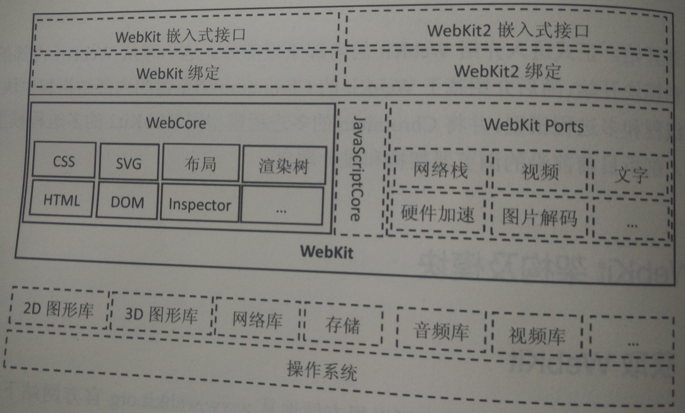
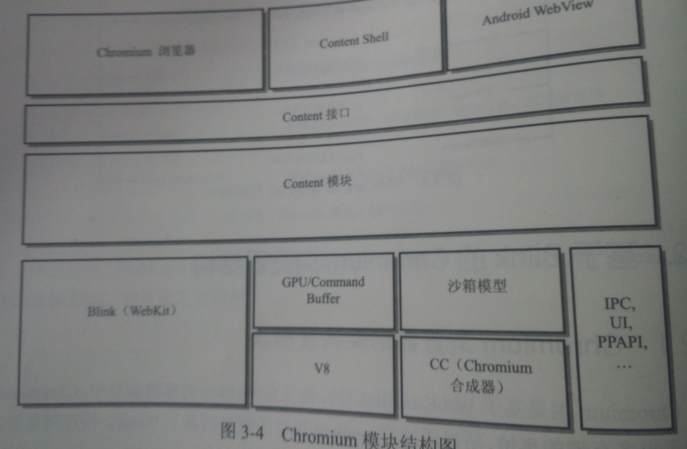
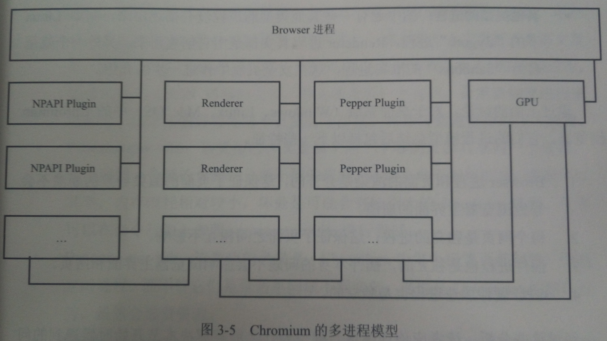

## WebKit 架构和模块

### WebKit 架构

#### 架构

和前面给出的架构图不同，这张图更加细致地描述了 WebKit 的架构。首先底下两层保持不变（不变的是需要这些模块，但是不同平台对于这些底层模块的实现是可以有差异的）。

在此之上，将 WebKit 引擎划分为 WebCore 和 WebKit Ports。前者是各个平台共享的部分，用实线包围，包括了加载和渲染网页的核心部分；WebKit Ports 则是非共享的部分，对于不同浏览器使用的 WebKit 来说，移植中的这些模块由于平台差异依赖的第三方库和需求不同等方面的原因，往往按照自己的方式来设计和实现，所以叫做移植部分。它包括了硬件加速、网络栈、视频解码、图片解码等。这部分对于性能和功能的影响很大。

在 WebCore 和 WebKit Ports 之上主要是嵌入式的编程接口，提供给浏览器调用。左右分别是狭义的 WebKit 和 Webkit2 的接口。因为接口具体与移植相关，所以有一个与浏览器相关的绑定层。绑定层上就是对外暴露的接口层。但是实际上接口层也是与移植相关的，所以不存在什么统一的接口。

> 这幅图没有提到的是测试用例，包括布局测试和性能测试两大类。另外每个浏览器所用的 WebKit 移植必须保证能够编译出来一个可执行程序，称为 DumpRenderTree，它被用来运行测试用例并将结果同期望结果对比。

#### 获取源码

我们可以从[官网](www.webkit.org)获取 WebKit 源码，进行编译，并可以选择编译不同版本的移植。比如 Qt 版、Safari版。

#### 源代码结构

WebKit 代码相当多，大概超过 500 万行。幸运地是目录结构非常清晰，通过目录基本可以了解 WebKit 的功能模块。

###### 主要的一级目录

- LayoutTests：各种各样的测试用例和渲染期望结果，包括文本和图片。
- PerformanceTests：各种各样的性能测试基准用例，包括著名的 Sunspider。
- Source：源代码目录。
- Tools：工具。

###### 主要的二级目录

- Source
 - JavaScriptCore：（默认的 Js 引擎）。
 - Platform：平台相关的代码。
 - WebCore：WebCore 包含的模块。
 - WebKit：WebKit 绑定和接口。
 - WebKit2：WebKit2 绑定和接口。
 - WTF：基础类库。
- Tools
 - DumpRenderTree：用于生成 DumpRenderTree。
 - gdb：帮助 gdb 调试 Python 脚本。
 - Scripts：各种脚本，负责编译、语法检查、代码提交等。
 - TestWebKitAPI：测试 WebKit 嵌入式 API 的测试代码。

###### 重要的三级目录

- WebCore
 - css：Css 解释器。
 - dom： DOM 节点基础类及树结构。
 - html：HTML 解释器和 DOM 节点类。
 - inspector：Web Inspector 的实现。
 - loader：资源加载器、缓存等。
 - page：与页面相关的全局对象的实现，包括 window、navigator 等 DOM 对象、事件、动画处理。
 - paltform：各个移植代码。
 - storage：存储的共享代码。
- WebKit2
 - eft：eft 主函数，构建简单的浏览器，还有很多移植代码。
 - NetworkProcess： 网络进程相关代码。
 - UIProcess：UI 进程相关代码。
 - WebProcess：Web 进程相关代码。 

### 基于 Blink 的 Chromium 浏览器结构

Chromium 本来是基于 WebKit 的，转向 Blink 以后 WebKit 删掉了 Chromium 平台移植相关的代码，而 Blink 则删掉了其它 WebKit 复制出来的其它平台相关的代码。了解 Chromium 可以帮助了解如何基于 WebKit 构建浏览器。另外，Chromium 之上还有这大量的创新和先进的理念。 

#### 模块和架构

从上图中可以看到，Blink 仅仅只是 Chromium 下层的一个模块，和它并列的还有著名的 V8 引擎，它代替了 WebKit 默认的 JavaScriptCore 引擎。

在这些模块之上是著名的 Content 模块和 Content API。Content 模块的功能是用来渲染网页。它与 WebKit 直接用来渲染网页有所不同，它是为了获得沙箱模型、跨进程 GPU 加速、众多 HTML5 功能而存在的，这些功能很多就是在 Content 模块中实现的。它们将下层的渲染、安全、插件等机制隐藏起来，提供一个接口层，供上层使用。

Chromium 浏览器、Chromium Shell、Android WebView 构建在这个 API 之上，前两者区别是 Chromium 浏览器是一个完整功能的浏览器，而 Chromium Shell 只是一个简单的“壳”。

Chromium Shell 的目的在于测试 Content 模块功能以及被外部项目参考用来开发相关项目。

而 Android WebView 目的则是用 Chromium 的实现来替换原来的系统默认 WebView。

#### 多进程模型

原来的浏览器都是单进程的，Chromium 率先尝试了多进程的架构，最明显的好处在于一个页面进程挂掉了，整个浏览器不会崩溃。在 Chromium 之后大多数主流浏览器都转向多进程的架构，WebKit2 当时便是为了支持多进程架构而出现的。

多进程带了很多好处的同时，也增加了浏览器的复杂性以及资源的占用。但是对于稳定性、安全性的提升来说，以复杂性和资源占用作为代价应该还是值得。

> 下面的线是指这些进程之前存在通信。

- Browser 进程：浏览器主进程，负责显示、页面管理，所有其它进程的祖先，负责它们的创建和销毁工作有且仅有一个。
- Renderer 进程：负责页面渲染。一般来说数量与打开的页面数一致。（存在不一致情况：用户配置和沙箱）
- NPAPI 进程：NPAPI 插件进程，每种类型只创建一次。
- GPU 进程：最多一个，GPU 硬件加速打开时才被创建。
- Pepper 进程：Pepper 插件创建的进程。
- 其他类型进程：如 Linux 下的 Zygote 等。 

> 原来以为只有 Browser 和 Renderer 进程，但是没想到啊。

从上面的进程其实我们可以简单分析一下：主进程和渲染进程分开，因此渲染进程奔溃并不会导致浏览器的崩溃；每个网页都是独立的进程，因此页面之间不会相互影响；插件也是独立的进程，因此插件奔溃也不会导致浏览器的奔溃；GPU 进程也是独立的。

在 Android 下面，稍微有些不同，因为 Android 系统的资源相对来说紧张，另外本身有一些限制。因此在 Android 下，GPU 进程变成了主进程的一个线程，Renderer 进程变成了服务进程。

###### 用户配置的 Renderer 进程

上面讲到用户可以对 Renderer 进程进行一些配置：

- Process-per-site-instance：每个页面建立一个独立的 Renderer 进程。
- Process-per-site：同一个域的页面共享同一个进程。
- Process-per-tab：每个标签页创建一个独立的进程（默认）。
- Single process：不为页面创建独立的进程，渲染工作在 Browser 的线程中进行。Android WebView 采用该模式。

###### Browser 进程和 Renderer 进程

上面简单地介绍了 Browser 进程和 Renderer 进程，可以在继续深入一下。

#### 多线程模型

### WebKit2