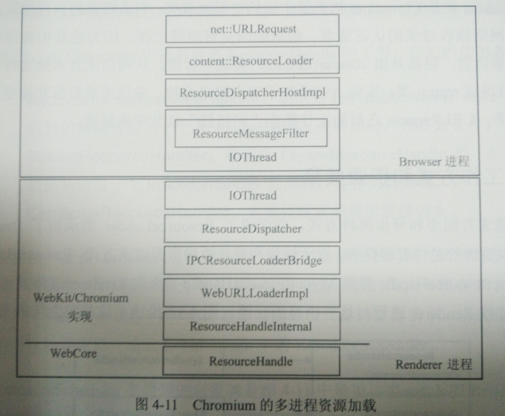

## 资源加载和网络栈
### WebKit 资源加载机制
#### 资源

下面是主要的资源类型：

- HTML：HTML 页面。
- JavaScript：JavaScript 代码，这里指的应该都是外联的。（虽然书上不这么说）
- Css 样式表：Css 样式资源，这里指的应该都是外联的。（虽然书上不这么说）
- 图片：各种编码格式的图片资源。
- SVG：用户绘制 SVG 的 2D 矢量图。
- Css Shader：为 Css 技术带来3D图形特性。
- 视频、音频、字幕。
- 字体文件：Css 支持自定义字体，Css3 引入自定义字体文件。
- XSL 样式表：用 XSLT 语言编写的 XSLT 代码文件。

它们在 WebKit 内部对应了不同的资源类，这些资源类都是 `CachedResource` 类的子类。继承 `CachedResource` 类目的是为了引入缓存机制。另外特殊的一个是 HTML 资源，它在 WebKit 中对应的类型是 `MainResource`，与其对应的资源类是 `CachedRawResource`，同样是 `CachedResource` 类的子类

#### 资源缓存

缓存资源是提高资源利用率的十分有效的做法。其最基本的思想就是建立一个资源缓存池，每次请求资源前都先去资源缓存池中查找，只有不存在时 WebKit 才会创建新的资源类用网络模块去请求资源，请求后将其设置到该资源类，缓存起来。而查找资源的关键字就是资源的 URL。

> 注意：的是这里的缓存中的是内存缓存，和后文网络栈部分的磁盘缓存不同。并且真实的过程要比上图描述得要复杂很多。

#### 资源加载器

WebKit 三类加载器：

1. 针对每种资源类型特定的加载器：如 `FontLoader`、`ImageLoader`，它们没用公共基类。
2. 资源缓存机制的资源加载器：所有特定加载器都共享它来查找和插入缓存资源。
3. 通用的资源加载器：只负责获得资源数据。

先了解，具体会在加载过程一节详细介绍。

#### 过程

以一张图片的加载过程为例：

1. `FrameLoader` 页面框架的加载器。
2. 加载完页面，在解析 HTML 到 img 元素时会创建一个 `ImageLoader` 资源类。
3. `ImageLoader` 资源类发起一个缓存资源加载的请求。
4. 此时会调用 `CachedResourceLoader` 来从缓存中获取。
5. 如果没有缓存，则会发起一个资源请求，此时调用的是 `ResourceLoader` 只负责获得资源数据。
6. 最后就会交由各个移植的网络模块相关的实现来加载资源。

> 为了不阻塞页面的渲染，大多数的加载都是异步的，目前我所知的只有 JavaScript 的加载是同步并且立即执行，阻塞页面的渲染的。所以一般将其放在页面底部。当然也有异步的做法，具体可以看我的一篇[博客](https://m2mbob.cn/2016/10/06/js-tong-bu-yi-bu-jia-zai-xiao-jie/)。

#### 资源的生命周期

1. 缓存池有限？
2. 什么时候需要更新资源？

解决第一个问题用的是 [LRU 算法](http://flychao88.iteye.com/blog/1977653)，这是操作系统中页面置换的一种算法，也通常被用作缓存淘汰算法。但是个人认为真正使用的应该是基于 LRU 的算法，例如 LRU-2、MQ(2)。

第二问题涉及 HTTP 的缓存机制，也就是如何知道一个资源在服务器上更新了，这种情况下即使有缓存也需要重新加载资源。两种情况，当设置了过期时间，那么这个资源在未过期的情况下就会按上面的过程加载资源，此时会从缓存中获取，不会发出 HTTP 请求，对应的状态码是 200（from cache）。如果资源过期，那么发起请求，这时服务器来进行判断，如果资源没有变，则会返回 304 状态码，还是从缓存中获取；资源改变，则返回新的资源。另外不同的用户行为也会影响资源的加载，例如 Ctrl+F5刷新，就会使 `Expires/Cache-Control` 和 `Last-Modified/Etag` 都无效，进行资源加载。具体可以看我的另一篇[博客](https://m2mbob.cn/2016/08/14/http-huan-cun/)。

### Chromium 多进程资源加载

#### 多进程

带资源缓存机制的资源加载过程一图最下方是 `ResourceHandleInternal` 和复杂的移植实现，表明每个移植都可以根据自己依赖模块以及内部机制的不同对资源加载有不同的实现。在 Chromium 中，加载资源的方式是利用多进程的资源加载架构。

Renderer 进程加载和解析网页过程中需要获取资源，但是出于安全（沙箱模型）和效率（资源共享）的考虑，Renderer 资源的获取实际上是通过进程间通信将加载任务交给 Browser 进程来执行。

1. Renderer 进程的 `ResourceHandleInternal` 类通过 `IPCResource-LoaderBridge` 类同 Browser 进行通信，作用是发起请求对象和回复结果的解释，实际的消息接受和派发交给 `ResourceDispatcher` 类来处理。
2. Browser 进程的 IO 线程中，首先会利用 `ResourceMessageFilter` 进行消息过滤，如果和资源请求相关则会转发请求给 `ResourceDispatcherHostImpl` 类，然后这个类会创建 `ResourceLoader`（Chromium 实际的资源加载类）对象来处理。`ResourceLoader` 负责统一管理请求工作相关的类。
3. 最后从网络或本地文件读取的信息是 `URLRequest` 类，它负责建立连接、发出请求、接收响应的任务。

#### 工作方式和资源共享

###### 工作方式

下面都是 `ResourceHandle` 的子类，代表了不同的工作方式（被 `ResourceLoader` 类管理）：

- `SyncResourceHandle`：同步。
- `AsyncResourceHandle`：异步。
- `LayeredResourceHandle`：没有实际意义，而是将处理传给另一个 `ResourceHandle`。
  - `BufferedResourceHandle`：缓冲网络或文件数据，直到满足要求转给另一个 `ResourceHandle`。
  - `ThrottlingResourceHandle`：多个请求共享一个 `URLRequest` 对象。
  - `RedirectToFileResourceHandle`：转给另一个 `ResourceHandle` 的同时转存到文件。
  - `StreamResourceHandle`：转给另一个 `ResourceHandle` 的同时，转存到数据流。
  - `CertificateResourceHandle`：处理证书类的资源请求。

###### 资源共享

因为资源统一交给 Browser 进程来进行管理，因此资源共享很容易。但是这也造成 Browser 进程需要处理大量的资源请求，为了更好地调度，Chromium 使用了 `ResourceScheduler` 这个调度器类。它调度的对象就是前面讲到的 `URLRequest` 对象，它根据 `URLRequest` 对象的标记和优先级来调度 `URLRequest` 对象。

对于以下类型的网络请求，Chromium 会立即发出：

1. 高优先级。
2. 同步请求。
3. 具有 SPDY （向 HTTP2 过渡的一种协议，目前这部分内容肯定有所改变了）能力的服务器。

### 网络栈